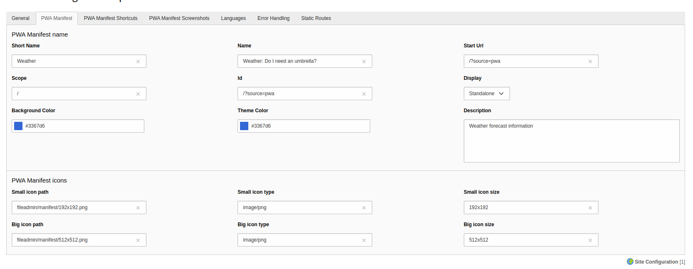
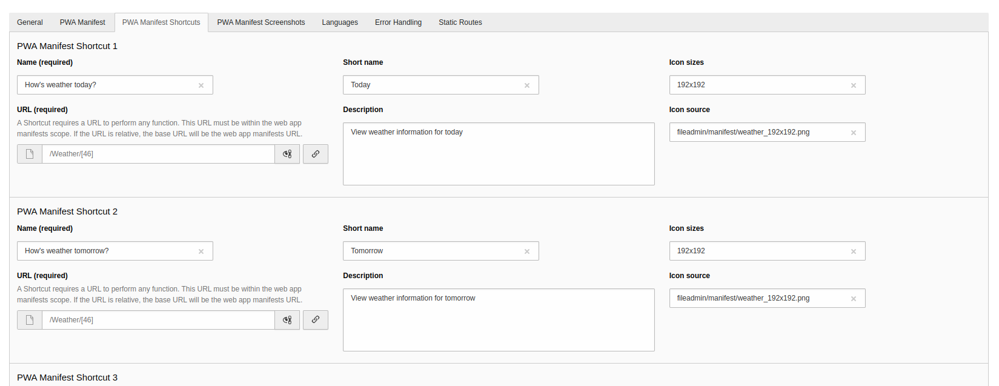
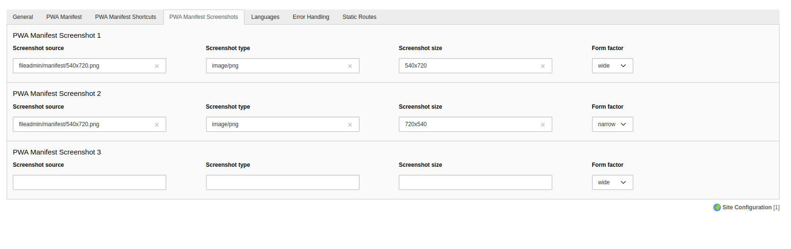

# TYPO3 Extension `wit_pwamanifest`

The `wit_pwamanifest` extension facilitates the management of manifest data to generate a Progressive Web App (PWA). This documentation outlines the installation process and provides details on the configuration options for managing the PWA manifest.

## Installation

Install this extension via `composer req woit/wit-pwamanifest` and activate
the extension in the Extension Manager of your TYPO3 installation.

## Configuration

Go straight to Site Configuration in your TYPO3 backend and edit your page.

The Basic Manifest section provides essential settings for configuring the appearance and behavior of your Progressive Web App (PWA). The setting includes Short Name, Name, Scope, ID, Display, Background Color, Theme Color, Description, and Start URL.

## PWA Manifest Icons

This screenshot showcases the PWA manifest icons configuration, which includes settings for small and large icons. Each icon requires the path, type, and size.

TYPO3 sites don't allow inline TCA, so we've created a separate configuration for shortcuts & screenshots. 

## Shortcuts

The Shortcuts Configuration section provides options for configuring shortcuts that enhance the user experience on your Progressive Web App (PWA). Each shortcut includes the following parameters: Name (Required), Short Name, Description, URL (Required), Icon Size, Icon Source

## Screenshots

The Screenshots Configuration section provides options for configuring screenshots that enhance the user experience on your Progressive Web App (PWA). Each screenshot includes the following parameters: Source, Type, Sizes, Form Factor

<<<<<<< HEAD
## Screenshots

Upon completing the essential site configuration, the final step is to seamlessly integrate this extension into your TYPO3 template. By doing so, the extension will automatically activate and incorporate the configured manifest data, enhancing the overall performance and user experience of your website.
=======
>>>>>>> ed3ba26805ffa37c42c818f8361f9503db5dd213
