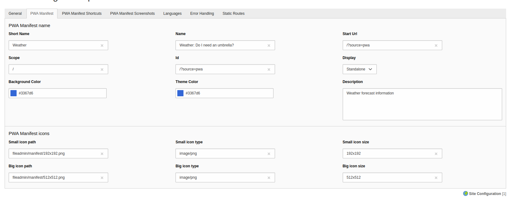
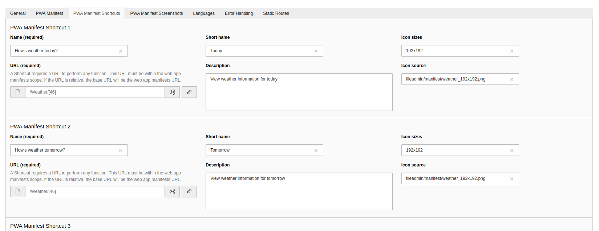
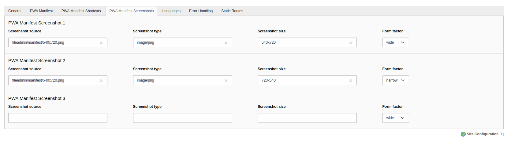

# TYPO3 Extension `wit_pwamanifest`

The `wit_pwamanifest` extension facilitates the management of manifest data to generate a Progressive Web App (PWA). This documentation outlines the installation process and provides details on the configuration options for managing the PWA manifest.

## Compatibility

TYPO3 13.4 - 14.x.

## Installation

Install this extension via `composer req woit/wit-pwamanifest` and activate
the extension in the Extension Manager of your TYPO3 installation.

## TypoScript integration

TYPO3 13+ sites configure TypoScript via **Sets** rather than static includes.
This extension ships a Set (`Configuration/Sets/WitPwamanifest`) that provides
the manifest endpoint and the `<link rel="manifest">` tag.

Add it to your site's `config.yaml`:

```yaml
dependencies:
  - woit/wit-pwamanifest
```


## Configuration

Go straight to Site Configuration in your TYPO3 backend and edit your page.


The Basic Manifest section provides essential settings for configuring the appearance and behavior of your Progressive Web App (PWA). The setting includes Short Name, Name, Scope, ID, Display, Background Color, Theme Color, Description, and Start URL.

## PWA Manifest Icons

This screenshot showcases the PWA manifest icons configuration, which includes settings for small and large icons. Each icon requires the path, type, and size.

TYPO3 sites don't allow inline TCA, so we've created a separate configuration for shortcuts & screenshots. 

## Shortcuts


The Shortcuts Configuration section provides options for configuring shortcuts that enhance the user experience on your Progressive Web App (PWA). Each shortcut includes the following parameters: Name (Required), Short Name, Description, URL (Required), Icon Size, Icon Source

## Screenshots


The Screenshots Configuration section provides options for configuring screenshots that enhance the user experience on your Progressive Web App (PWA). Each screenshot includes the following parameters: Source, Type, Sizes, Form Factor

Upon completing the essential site configuration, the final step is to seamlessly integrate this extension into your TYPO3 template. By doing so, the extension will automatically activate and incorporate the configured manifest data, enhancing the overall performance and user experience of your website.

## Offline support / Service Worker

Enable "Enable service worker / offline support" in Site Configuration to
register a minimal service worker on the frontend. It caches one offline
fallback page and serves it whenever a page navigation fails due to no
network connection. It does not cache other assets or pages.

- **Enable service worker / offline support** – toggles the feature on/off.
- **Offline fallback page** – the page shown while offline. Falls back to
  the manifest `start_url` (or `/`) if left empty.

The service worker script is served through the same `typeNum`-based
endpoint mechanism as the manifest (`?type=836`), with a
`Service-Worker-Allowed: /` response header, which grants it control over
the entire site (`scope: '/'`) despite not being served from a literal
`/service-worker.js` path. No RouteEnhancer or docroot changes are required.

This is intentionally minimal - no asset caching, no configurable caching
strategy, no versioned multi-cache setup. It only makes the site installable
with a working offline fallback.