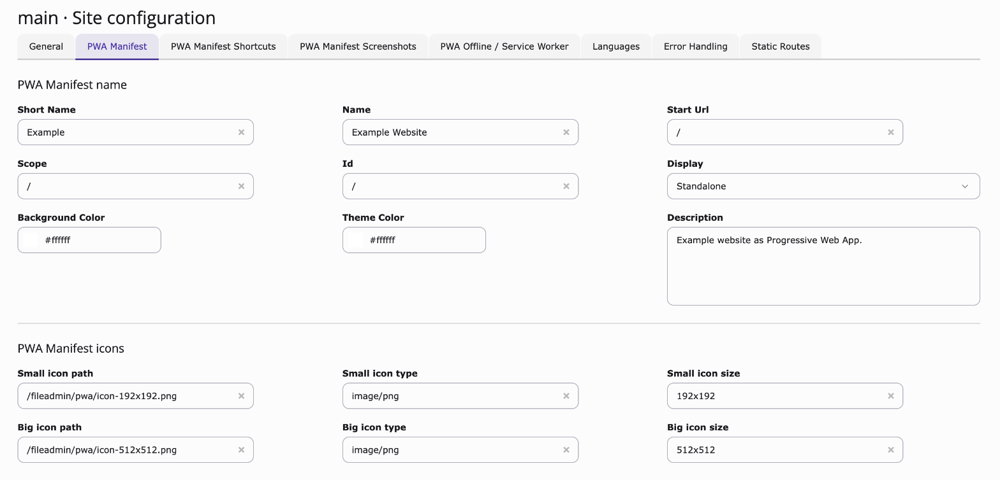
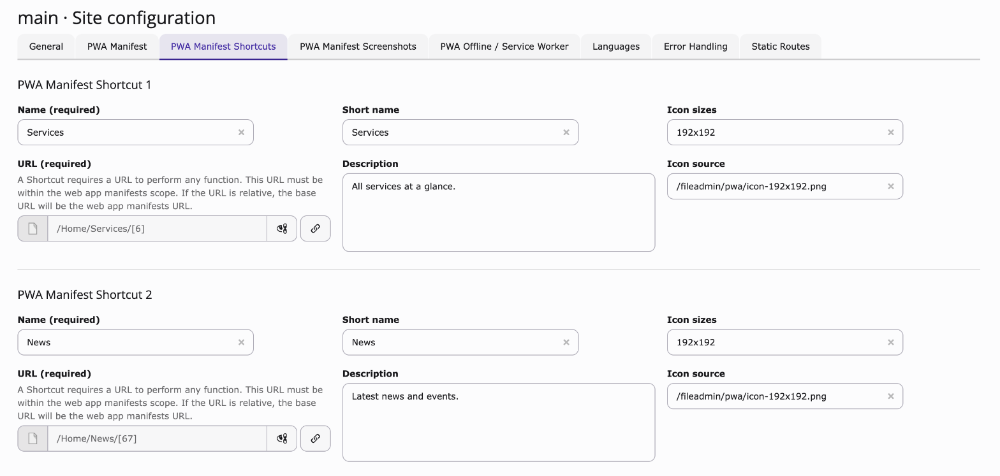
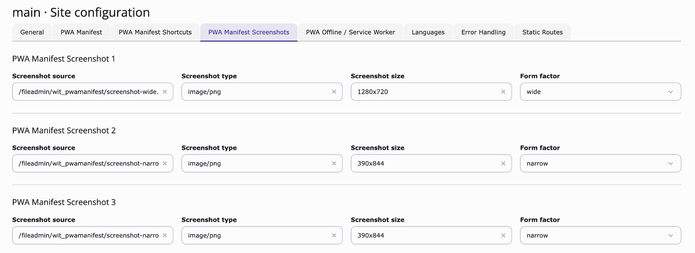
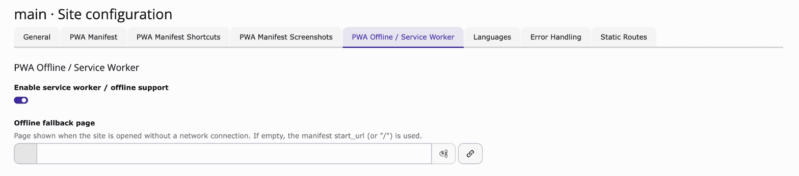

# TYPO3 Extension `wit_pwamanifest`

Make your TYPO3 site installable and offline-ready with a Progressive Web App
(PWA) manifest and a minimal service worker. All values are maintained in the
TYPO3 site configuration.

The full documentation is located in [`Documentation/`](Documentation/Index.rst)
and is rendered on [docs.typo3.org](https://docs.typo3.org/).

## Compatibility

TYPO3 13.4 - 14.x.

## Installation

```bash
composer require woit/wit-pwamanifest
```

## TypoScript integration

TYPO3 13+ sites configure TypoScript via **Site sets** rather than static
includes. This extension ships the Set `woit/wit-pwamanifest`
(`Configuration/Sets/WitPwamanifest`). It provides the manifest endpoint, the
service worker endpoint and the `<link rel="manifest">` tag.

Add it to your site's `config.yaml`:

```yaml
dependencies:
  - woit/wit-pwamanifest
```

If a `sys_template` record of the site has **Clear > Setup** checked, it
removes the setup TypoScript of the Site set. Include the static template
**WIT PWA Manifest (wit_pwamanifest)** in that record instead. Symptom otherwise: `?type=835` returns
`No page configured for type=835.`

Output only one `<link rel="manifest">` per page. Remove manifest links from
your site package, otherwise the browser does not use this extension's manifest.

| Endpoint       | URL           | Content-Type                |
|----------------|---------------|-----------------------------|
| Manifest       | `?type=835`   | `application/manifest+json` |
| Service worker | `?type=836`   | `application/javascript`    |

## Configuration

Open the site configuration in the TYPO3 backend (TYPO3 v14: **Sites > Setup**) and edit your site.
The extension adds four tabs.



### PWA Manifest

Basic manifest data: Short Name, Name, Start Url, Scope, Id, Display
(`standalone`, `fullscreen`, `minimal-ui`, `browser`), Background Color,
Theme Color and Description.

Icons: one small and one big icon, each with path, type (e.g. `image/png`)
and size (e.g. `192x192`). An icon is only added if its path is set.

Empty fields are omitted from the manifest.

Shortcuts and screenshots are provided as three fixed field groups each.

### PWA Manifest Shortcuts



Up to three shortcuts with Name, Short name, Description, URL, Icon source
and Icon sizes. A shortcut is only added to the manifest if **URL** and at
least one of **Name** or **Short name** are set.

### PWA Manifest Screenshots



Up to three screenshots with Source, Type, Size and Form factor (`wide`,
`narrow`). A screenshot is only added to the manifest if **Source** is set.

### PWA Offline / Service Worker



- **Enable service worker / offline support** – registers the service worker
  on every page.
- **Offline fallback page** – page shown when a navigation fails because
  there is no network connection. Falls back to the manifest `start_url`
  (or `/`) if left empty.

## Offline support / Service worker

The service worker script is served through the same `typeNum`-based
mechanism as the manifest (`?type=836`) with a `Service-Worker-Allowed: /`
response header. It is registered with `scope: '/'`. No RouteEnhancer or
docroot changes are required.

Behaviour:

- **Install:** the offline fallback page is stored in the cache
  `wit-pwa-offline-v2`.
- **Activate:** all other caches of the origin are deleted.
- **Page navigation:** network first; on failure the cached offline fallback
  page is returned.
- **Styles, scripts, fonts, images:** cache first; stored on first request.
  Assets requested before are served from the cache, also offline.
- Non-`GET` requests and non-`http(s)` requests (e.g. browser extensions)
  are not handled.
- The scope `/` includes the TYPO3 backend (`/typo3/`); backend assets are
  cached as well.

This is intentionally minimal: no configurable caching strategy and no cache
versioning per deployment. Use versioned asset URLs (TYPO3 default cache
busting) so changed files are loaded.

Disabling the option only stops registration on new page loads. An already
installed service worker stays active in the browser until it is
unregistered.

## Rendering the documentation locally

```bash
docker run --rm --pull always -v "$(pwd)":/project -it \
  ghcr.io/typo3-documentation/render-guides:latest --config=Documentation
```

Output: `Documentation-GENERATED-temp/Index.html`
